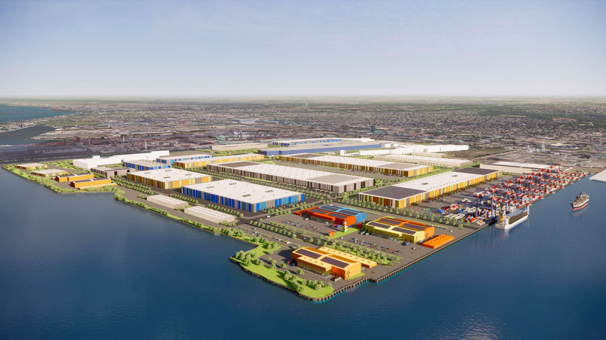

# 03 Current Development Proposal

SLATE - An early Slate concept drawing of the former Stelco lands redevelopment project showed public access to the water’s edge.

## Overview

Steelport is the proposed redevelopment of approximately 800 acres of former Stelco industrial lands on the Hamilton waterfront.

Led by Slate Asset Management, the project is envisioned as a long-term industrial district focused on employment, infrastructure, manufacturing, innovation, logistics, and emerging technologies.

Public materials indicate that the project is intended to be developed over multiple phases and supported by district-scale infrastructure systems rather than individual site-by-site development.

At the time of writing, Steelport remains a proposed development. The information below reflects publicly available plans, statements, planning submissions, and project materials.

---

## Development Vision

Public project materials describe Steelport as a next-generation industrial district designed to support:

* Advanced manufacturing
* Research and innovation
* Industrial employment
* Clean infrastructure
* Logistics and distribution
* Emerging technology sectors
* Artificial intelligence infrastructure

Slate has stated that the redevelopment aims to transform former industrial lands into a major economic and employment hub while retaining the site's industrial character and strategic transportation advantages.

The project is being presented as one of the largest industrial redevelopment initiatives currently underway in Canada.

---

## Site Layout

Public subdivision materials indicate that the redevelopment is organized into a series of large development blocks connected by a new internal road network.

Reported components include:

* Approximately 684 acres of gross development area
* Approximately 62 acres of public right-of-way
* Approximately 91 acres of open space and amenity areas
* Approximately 23 acres of water bodies
* Approximately 78 acres retained by Stelco Steel Mills

The site plan introduces new transportation corridors, utility corridors, public spaces, and development parcels intended to support future industrial and commercial uses.

Because the project is expected to be built over many years, the final configuration may evolve as approvals and construction progress.

---

## Transportation Infrastructure

Steelport is designed around existing regional transportation advantages.

Public materials identify:

* Direct access to Hamilton Harbour
* Access to the Great Lakes and St. Lawrence Seaway
* Existing rail infrastructure
* Ontario highway connections
* Proximity to Hamilton International Airport
* Proximity to Toronto Pearson International Airport
* Access to the United States border

The draft plans include approximately 10 kilometres of new internal roads intended to support future industrial and commercial development.

The site's transportation assets are frequently cited as one of its primary competitive advantages.

---

## Energy Infrastructure

One of the most distinctive aspects of the Steelport proposal is its emphasis on district-scale energy planning.

Publicly discussed elements include:

* Micro-grid development
* District energy systems
* Distributed energy resources
* Energy storage systems
* On-site power management
* Industrial-scale bay water cooling
* Energy resilience planning

Hamilton Community Enterprises (HCE) has publicly stated that it is working with Slate Asset Management on an integrated energy strategy for the site.

According to the City of Hamilton's Connected Communities Strategy, this work includes exploring:

* A micro-grid
* District energy infrastructure
* Distributed energy resources
* Energy storage
* Waste heat recovery opportunities

The project builds upon HCE's previous Energy Harvesting Initiative, which examined the feasibility of capturing and reusing residual industrial heat within Hamilton's Bayfront Industrial Area.

At present, public materials indicate that these systems are being explored and planned. Final implementation details remain subject to design, engineering, approvals, and future development decisions.

---

## Waterfront and Public Realm

Steelport's plans extend beyond industrial development.

Public materials describe several waterfront and public realm components intended to reconnect portions of Hamilton Harbour with the surrounding community.

These include:

* The Steelport Loop Trail
* Public waterfront access
* Open space corridors
* Pedestrian connections
* Cycling infrastructure
* Public gathering spaces

Several named destinations appear in public planning materials, including:

### The Lagoonscape

Described as a regenerated landscape that combines biodiversity objectives with stormwater management functions.

### The Pipe Gallery

A proposed adaptive reuse project intended to preserve elements of the site's industrial heritage while creating space for community, commercial, and cultural activities.

### The Waterfront

Public access areas designed to improve connectivity between the redevelopment and Hamilton Harbour.

### The Battery

A proposed mixed-use district within the broader Steelport vision.

Many of these concepts remain in the planning stage and should be understood as proposed features rather than completed infrastructure.

---

## Environmental Components

Environmental considerations appear throughout publicly available planning materials.

Examples include:

* Stormwater management systems
* Open space preservation
* Biodiversity-focused landscape design
* Waterfront rehabilitation
* Adaptive reuse of industrial structures
* District energy planning
* Waste heat utilization studies

The Lagoonscape is particularly notable because it combines ecological and infrastructure functions within a single system.

The extent to which these elements are ultimately implemented and measured remains an important question for future study.

---

## Economic Development Objectives

Public project materials describe Steelport as a major economic development initiative.

Various public statements have referenced:

* Significant private investment
* Thousands of construction jobs
* Long-term employment opportunities
* Regional economic growth
* Industrial expansion
* Attraction of new industries

These figures represent publicly stated projections and ambitions associated with the project.

They should not be interpreted as confirmed outcomes.

Actual economic impacts will depend on future approvals, tenants, infrastructure investment, market conditions, and development timelines.

---

## Approval Status

Steelport remains an active redevelopment project undergoing planning and approval processes.

Publicly reported milestones include:

* Acquisition of the former Stelco lands by Slate Asset Management
* Submission of draft subdivision plans
* Community engagement initiatives
* Infrastructure planning studies
* Energy strategy development
* Municipal review processes

Several components of the broader redevelopment remain subject to regulatory review, engineering studies, environmental assessment requirements, and future planning approvals.

As a result, portions of the project may evolve over time.

---

## Working Observation

Based on publicly available information, Steelport appears to be pursuing a district-scale redevelopment strategy that integrates transportation, energy, industrial development, public access, and environmental planning.

Several elements currently under consideration, including district energy systems, waste heat utilization, energy storage, waterfront restoration, and public realm improvements, align with broader conversations occurring across North America regarding the future of industrial and computing infrastructure.

The degree to which these ambitions are implemented, measured, and maintained over time remains an open question and an important area for future examination.

---

## Sources

* Steelport Official Website
* Slate Asset Management Development Materials
* City of Hamilton Connected Communities Strategy
* Hamilton Community Enterprises
* ConstructConnect Project Reporting
* RENX Project Reporting
* Hamilton-Halton Construction Association Project Reporting
