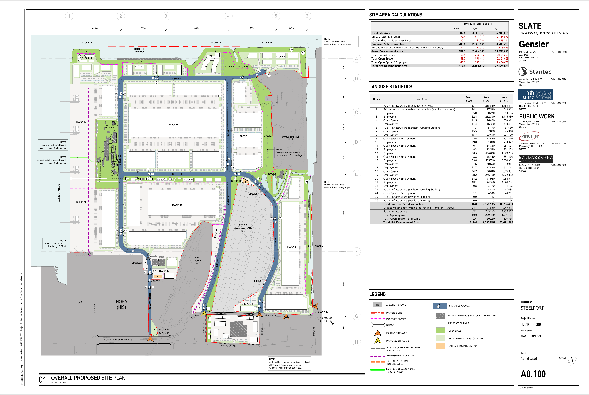

# Site Overview

## Introduction

Steelport is a proposed large-scale industrial redevelopment project located on former Stelco lands along Hamilton Harbour in Hamilton, Ontario. The project is being advanced by Slate Asset Management and its partners as a long-term employment and industrial district intended to support advanced manufacturing, logistics, technology, and related economic development activities.

The redevelopment represents one of the largest brownfield transformation projects currently proposed in Canada. Rather than expanding onto undeveloped greenfield land, the project focuses on the repurposing of historically industrial lands that have been associated with steel production and heavy industry for generations.

## Location

The Steelport site occupies a strategic position within Hamilton's Bayfront Industrial Area.

Key transportation advantages identified in public project materials include:

* Direct access to Hamilton Harbour
* Access to the Great Lakes and St. Lawrence Seaway
* Existing rail infrastructure
* Connections to Ontario's highway network
* Proximity to Hamilton International Airport
* Proximity to Toronto Pearson International Airport
* Access to major Canada–United States trade corridors

These transportation assets are frequently cited as a primary reason the site is being positioned as a major industrial and employment hub.

## Site Composition

Public subdivision materials indicate that the redevelopment is organized into a series of large development blocks connected by a new internal road network.

The Draft Plan of Subdivision identifies:

* Approximately 805.8 acres of total site area
* Approximately 682.7 acres of gross development area
* Approximately 65.5 acres of public infrastructure
* Approximately 63.1 acres of open space and amenity areas
* Approximately 24.1 acres of water bodies
* Approximately 78 acres retained by Stelco Steel Mills

The proposed subdivision framework introduces new transportation corridors, utility corridors, public spaces, and development parcels intended to support future industrial and commercial uses.

Several large employment blocks remain flexible in their ultimate use, allowing future tenants and development phases to influence the final character of the site.

## Draft Plan of Subdivision

**Figure 1. Overall Proposed Site Plan**

*Source: Draft Plan of Subdivision, Steelport Masterplan.*

The Draft Plan of Subdivision provides an overview of the proposed physical framework for the redevelopment. The plan illustrates major development parcels, transportation corridors, open space areas, waterfront connections, retained industrial lands, and supporting infrastructure.

The subdivision framework establishes the site's long-term structure while allowing individual development blocks to be built and occupied over time.

## Brownfield Redevelopment Context

Steelport is notable because it represents a brownfield redevelopment project rather than a greenfield expansion.

Brownfield redevelopment can offer several potential advantages, including:

* Reuse of previously developed land
* Utilization of existing transportation infrastructure
* Reduced pressure on agricultural and natural lands
* Opportunities for environmental remediation
* Preservation of regional employment areas

The extent to which these potential benefits are realized depends on future design decisions, remediation activities, infrastructure implementation, and long-term site management.

## Long-Term Development Horizon

Public planning materials indicate that Steelport is expected to be developed in multiple phases over an extended period.

As a result, the subdivision plans should be understood as a framework rather than a final built outcome.

Building design, tenant selection, infrastructure implementation, environmental performance, public realm features, and economic outcomes will be shaped by future approvals, engineering work, investment decisions, and construction phases.

This distinction is important when evaluating the project. The subdivision plans establish the physical structure of the redevelopment, but many aspects of the site's eventual character remain subject to future decisions.
