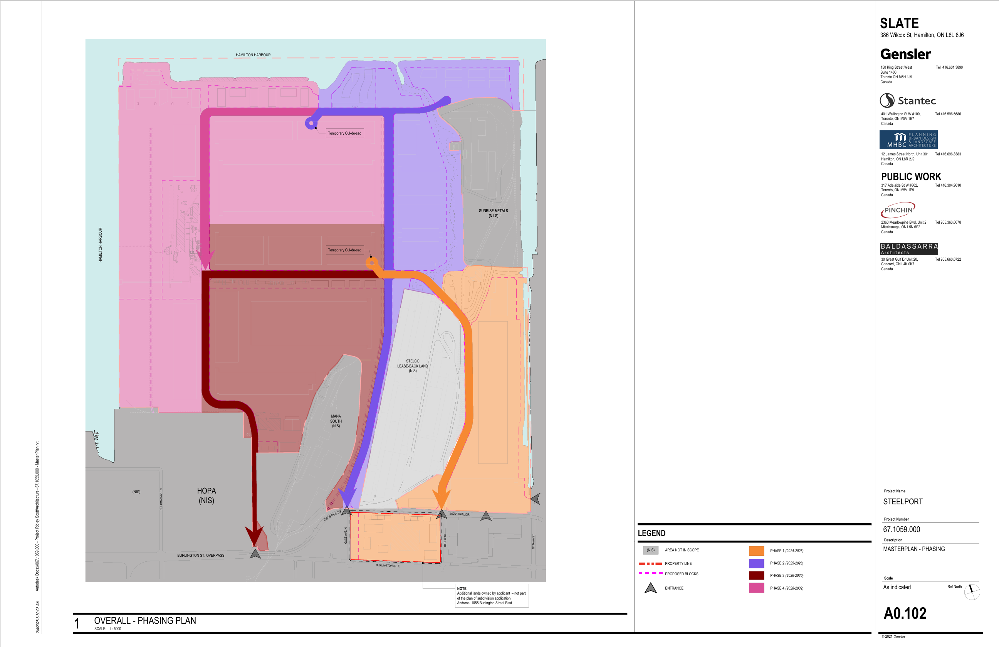

# Development Strategy

## Introduction

Steelport is envisioned as a long-term redevelopment of former industrial lands along Hamilton Harbour. Public planning materials indicate that the project is expected to be implemented through multiple phases rather than constructed as a single development.

This phased approach allows infrastructure, utilities, transportation systems, and development parcels to be delivered over time while responding to evolving market conditions, tenant requirements, regulatory approvals, and investment decisions.

As a result, the project should be understood as a development framework rather than a fully predetermined end state.

## Phased Development Approach

The Draft Plan of Subdivision includes a phased development strategy that divides the site into multiple implementation stages.

**Figure 2. Proposed Development Phasing**

*Source: Draft Plan of Subdivision, Steelport Masterplan.*

The phasing plan identifies four primary development phases distributed across the site.

While timelines may evolve, the phased approach demonstrates that development is intended to occur progressively over an extended period rather than through a single construction program.

The sequencing of development allows infrastructure and servicing investments to be aligned with future occupancy and market demand.

## Flexibility of Future Development

One of the most notable characteristics of the subdivision framework is the size and flexibility of the proposed employment blocks.

Several development parcels encompass substantial areas that could accommodate a wide range of future uses, including:

* Advanced manufacturing
* Logistics and distribution
* Technology and innovation facilities
* Industrial research and development
* Energy infrastructure
* Other employment-generating activities

Public subdivision materials establish the physical framework of these parcels but do not fully determine the final form, architecture, operational characteristics, or environmental performance of future development.

These decisions will occur during subsequent planning, design, engineering, and tenant approval processes.

## Infrastructure First Strategy

The proposed development strategy places significant emphasis on establishing foundational infrastructure.

Public materials identify plans for:

* Internal transportation corridors
* Utility corridors
* Servicing infrastructure
* Energy infrastructure planning
* Public realm improvements
* Waterfront access connections

This infrastructure-first approach creates the conditions necessary for future development while allowing individual blocks to be developed independently as opportunities arise.

## Long-Term Buildout Considerations

Large-scale industrial redevelopment projects are often implemented over many years.

Factors that may influence the pace and character of development include:

* Market demand
* Tenant attraction
* Infrastructure investment
* Economic conditions
* Regulatory approvals
* Environmental requirements
* Technological change

Because of these variables, the final configuration of Steelport may differ from early conceptual illustrations and planning materials.

The subdivision framework establishes the site's structure, but many details of future development remain subject to future decisions.

## Implications for Evaluation

The phased nature of the project is important when evaluating both opportunities and risks.

Some elements of the redevelopment, such as road networks, development blocks, open space allocations, and waterfront corridors, are visible within current planning documents.

Other outcomes, including building design, energy systems, environmental performance, public realm quality, and tenant-specific initiatives, will depend on future implementation decisions.

For this reason, assessments of Steelport should distinguish between:

* Approved or proposed subdivision infrastructure
* Publicly stated project objectives
* Conceptual design aspirations
* Future outcomes that remain dependent on implementation

This distinction helps separate documented plans from future possibilities and provides a more accurate basis for evaluating the redevelopment over time.
