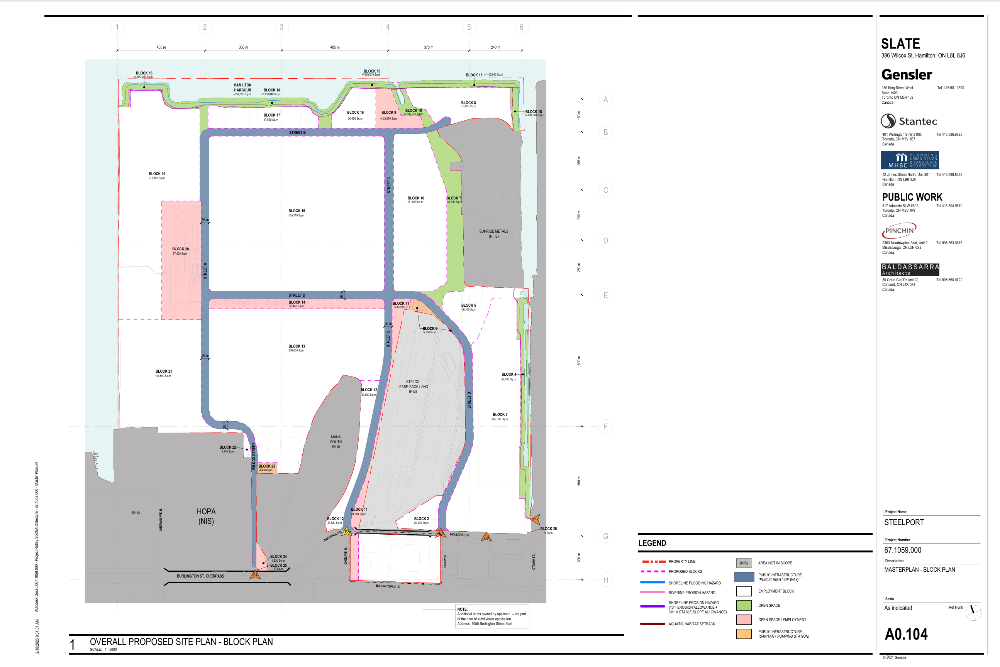

# Waterfront and Land Use Framework

## Introduction

The Steelport redevelopment occupies a prominent position along Hamilton Harbour and incorporates a combination of employment lands, transportation infrastructure, open space corridors, waterfront access areas, and environmental setback zones.

Public subdivision materials indicate that the redevelopment is intended to balance industrial and employment objectives with public realm improvements and waterfront connectivity.

The Draft Plan of Subdivision provides insight into how these elements are organized across the site.

## Land Use Structure

The subdivision framework is organized around a series of large employment blocks connected by a new internal road network.

**Figure 3. Land Use and Block Plan**

*Source: Draft Plan of Subdivision, Steelport Masterplan.*

The plan identifies:

* Employment development blocks
* Internal transportation corridors
* Open space areas
* Waterfront access corridors
* Utility and servicing areas
* Retained industrial lands
* Water bodies and shoreline features

The framework establishes the physical structure of the redevelopment while maintaining flexibility for future tenants and development phases.

## Employment Lands

A significant portion of the site is allocated to employment uses.

The subdivision plan identifies several large development blocks capable of accommodating a wide range of future industrial and commercial activities.

Public materials have referenced potential uses including:

* Advanced manufacturing
* Logistics and distribution
* Technology-related industries
* Research and development facilities
* Energy infrastructure

The subdivision framework establishes parcel boundaries but does not determine the final design, operation, or occupancy of future buildings.

These decisions will occur through subsequent planning and development processes.

## Waterfront Access

The Steelport Loop

A central organizing feature of the Urban Design Report is the proposed Steelport Loop, a public realm framework intended to connect major destinations across the site.

Public materials describe the Steelport Loop as:

Approximately 4 kilometres in length
Approximately 50 minutes by foot
Approximately 16 minutes by bicycle

The loop is intended to connect several major public destinations identified in the planning framework, including:

The Waterfront
The Lagoonscape
The Pipe Gallery
The Battery

The Urban Design Report presents the Steelport Loop as a mechanism for reconnecting Hamiltonians with portions of the harbour waterfront while linking together public amenities, active transportation routes, ecological corridors, and industrial districts.

As with other elements of the vision framework, implementation remains subject to future planning, engineering, approvals, partnerships, and investment decisions.

Public planning materials describe:

* Waterfront access corridors
* Pedestrian connections
* Cycling infrastructure
* Public gathering spaces
* The Steelport Loop Trail

The subdivision plan allocates portions of the waterfront to open space and public infrastructure rather than development parcels.

These allocations suggest that waterfront access has been incorporated into the planning framework rather than existing solely as a conceptual design objective.

## Open Space and Environmental Setbacks

The subdivision plan identifies a network of open space areas distributed throughout the site.

In addition, the plan includes several environmental constraints and setback areas associated with the waterfront.

Examples shown in the planning materials include:

* Shoreline hazard limits
* Erosion allowances
* Aquatic habitat setbacks
* Water bodies
* Open space corridors

These areas establish physical buffers between portions of the redevelopment and Hamilton Harbour.

The presence of these features does not, by itself, determine ecological outcomes. However, they create opportunities for environmental restoration, habitat enhancement, stormwater management, and public realm improvements as future phases proceed.

## Public Realm Opportunities

Public project materials describe several proposed public realm destinations, including:

* The Steelport Loop Trail
* The Lagoonscape
* The Pipe Gallery
* Waterfront gathering areas
* Cycling and pedestrian infrastructure

Many of these elements remain in the planning stage and should be understood as proposed components rather than completed infrastructure.

Their eventual form, scale, and implementation will depend on future design, engineering, approvals, and investment decisions.

## Observations

The subdivision framework demonstrates that Steelport is not solely an industrial development proposal.

The plans incorporate employment lands, transportation infrastructure, open space networks, environmental setback areas, and waterfront access within a single redevelopment framework.

At the same time, the subdivision plans do not determine the final environmental performance or public realm quality of the site.

Those outcomes will depend on future implementation decisions, tenant commitments, infrastructure investments, and long-term site management.

For this reason, the current plans are best understood as establishing the physical conditions that make future environmental and public realm outcomes possible, rather than guaranteeing those outcomes.
